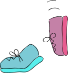
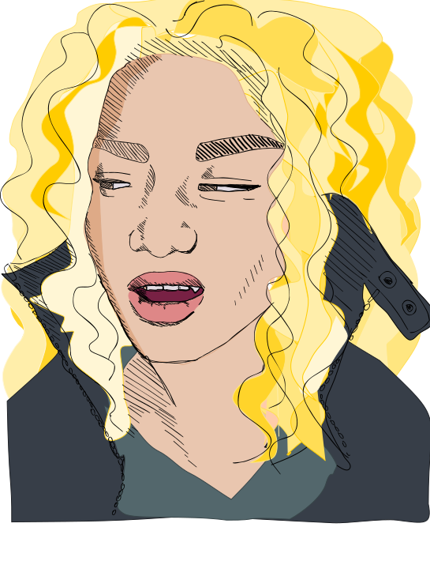

# Laura Ambrose

---

### TLDR

Front End Developer, based in Singapore, working most recently with **React**
and **Redux**.

---

* **JavaScript** I have been working with Javascript in various forms since I
began. Initially I worked on large projects using Javascript, JQuery and
AngularJS to display visuals using data from our clients API. Following this I
went on to work on a social learning web app set in a Backbone-Marionette stack. Most recently I have been working with ReactJS / Redux and GraphQL, integrating with APIs and creating simple APIs in Node.js.

    

* **Style** I have had a lot of experience with CSS throughout my coding life,
starting with the Front End course at GA and throughout my career as a Front End
developer. CSS has changed significantly over the years, now sometimes replacing
the need for JavaScript. I have used pure CSS, and preprocessors such as SASS,
SCSS and LESS. Experimenting with CSS is a lot of fun, and more recently I have
been playing with SVG design and animation. In my day to day work life I build
fully responsive pages and components to design, working with designers to bring
their flat designs to life with animations and consideration of the full UX
experience on interactive platforms.

    

* **Production** Working with teams of local and remote developers I have had
valuable experience working with GIT on collaborative projects and with Webpack,
Circle CI, QA engineers and unit testing as integral parts of my day to day work
processes.

    

* **Integration** a front end developer integration and collaboration with other
developers is an essential skill, I worked in a .NET stack at Durable,
integrating with C# in Umbraco and Sitecore CMS systems. Following this I went
on to work with a full stack team at Fuse where we were integrating Ruby with
Backbone Marionette. My most recent experience was with a React stack at
KintoHub, where we worked in microservices and a complete separation of
interests. the front end communicated with back end services exclusively via
APIs, using REST at first and then via GraphQL.

